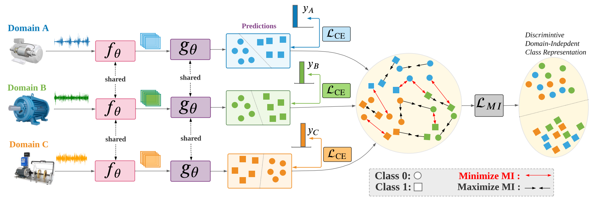

#  Conditional Contrastive Domain Generalization For Fault Diagnosis (CCDG) [[Paper]()]
#### *by: Mohamed Ragab, Zhenghua Chen, Wenyu Zhang, Emadeldeen Eldele,  Min Wu, Chee Keong Kwoh, and  Xiaoli Li*
#### IEEE Transactions on Instrumentation and Measurement (TIM-21) (Impact Factor: 4.06).

## Abstract

 Data-driven fault diagnosis plays a key role in stability and reliability of operations in modern industries. Recently, deep learning has achieved remarkable performance in fault classification tasks. However, in reality, the model can be deployed under highly varying working environments. As a result, the model trained under a certain working environment (i.e., certain distribution) can fail to generalize well on data from different working environments (i.e., different distributions). The naive approach of training a new model for each new working environment would be infeasible in practice. To address this issue, we propose a novel conditional contrastive domain generalization (CCDG) approach for fault diagnosis of rolling machinery, which is able to capture shareable class-information and learn environment-independent representation among data collected from different environments (also known as domains). Specifically, our CCDG attempts to maximize the mutual information of similar classes across different domains while minimizing mutual information among different classes, such that it can learn domain-independent class representation that can be transferable to new unseen domains. Our proposed approach significantly outperforms state-of-the-art methods on two real-world fault diagnosis datasets with an average improvement 7.75\% and 2.60\% respectively. The promising performance of our proposed CCDG on new unseen target domain contributes towards more practical data-driven approaches that can work under challenging real-world environments.
 
## Requirmenets:
- Python3.x
- Pytorch==1.7
- Numpy
- Sklearn
- Pandas
- mat4py (for Fault diagnosis preprocessing)

## Datasets
### Download datasets
We used four public datasets in this study:
- [CWRU Dataset](https://csegroups.case.edu/bearingdatacenter/pages/welcome-case-western-reserve-university-bearing-data-center-website) 
- [Paderborn Dataset](https://mb.uni-paderborn.de/en/kat/main-research/datacenter/bearing-datacenter/data-sets-and-download)

### Preparing datasets
1. Use the provided datapreprocessing codes to process the data. 
2. To process CWRU Dataset run the notebook in "CWRU_PreProcessing"   
3. To process Paderborn Dataset run the notebook in "KAT_PreProcessing"


### Reprodunce the results:
1. Clone the repository 
2. Download the fault diagnosis datsets. 
3. Use the provided datapreprocessing codes to process the data. 
4. Run ''''CCDG/reproduce_CCDG_sweep'''.

## Citation
If you found this work useful for you, please consider citing it.
```
@article{amda_tim,
  author={Mohamed Ragab, Zhenghua Chen, Wenyu Zhang, Emadeldeen Eldele,  Min Wu, Chee Keong Kwoh, and  Xiaoli Li},
  journal={IEEE Transactions on Instrumentation and Measurement}, 
  title={Conditional Contrastive Domain Generalization For Fault Diagnosis}, 
  year={2022},
  volume={},
  number={},
  pages={},
  doi={}}
```

## Contact
For any issues/questions regarding the paper or reproducing the results, please contact me.   
Mohamed Ragab    
School of Computer Science and Engineering (SCSE),   
Nanyang Technological University (NTU), Singapore.   
Email: mohamedr002{at}e.ntu.edu.sg   
